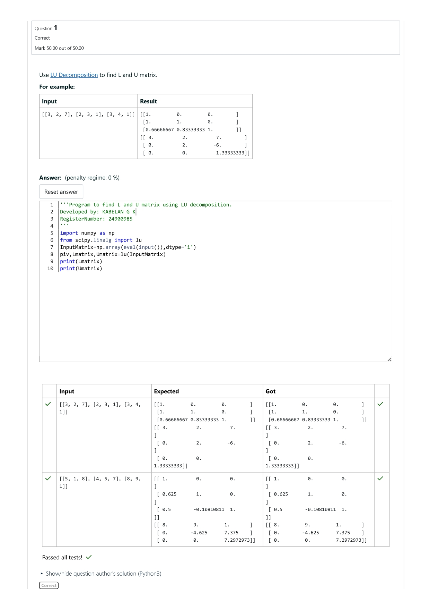
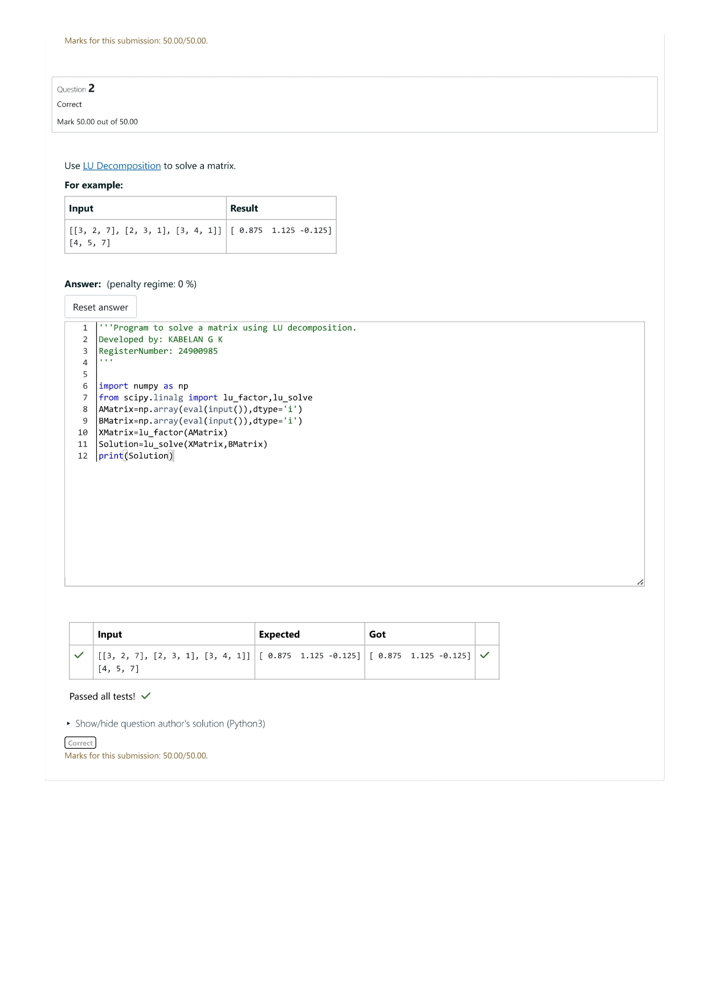

# LU Decomposition 

## AIM:
To write a program to find the LU Decomposition of a matrix.

## Equipments Required:
1. Hardware – PCs
2. Anaconda – Python 3.7 Installation / Moodle-Code Runner

## Algorithm
1. Start the program
2. Import the necessary libraries(numpy,scipy.linalg)
3. Define the matrix using numpy
4. Use lu(),lu_solve(),lu_factor() to get the solutions
5. End the program

## Program:
(i) To find the L and U matrix
```
'''Program to find L and U matrix using LU decomposition.
Developed by: KABELAN G K
RegisterNumber: 24900985
'''
```
```
import numpy as np
from scipy.linalg import lu
InputMatrix=np.array(eval(input()),dtype='i')
piv,Lmatrix,Umatrix=lu(InputMatrix)
print(Lmatrix)
print(Umatrix)
```
(ii) To find the LU Decomposition of a matrix
```
'''Program to solve a matrix using LU decomposition.
Developed by: KABELAN G K
RegisterNumber: 24900985
'''
```
```
import numpy as np
from scipy.linalg import lu_factor,lu_solve
AMatrix=np.array(eval(input()),dtype='i')
BMatrix=np.array(eval(input()),dtype='i')
XMatrix=lu_factor(AMatrix)
Solution=lu_solve(XMatrix,BMatrix)
print(Solution)
```
## Output:
 


## Result:
Thus the program to find the LU Decomposition of a matrix is written and verified using python programming.

